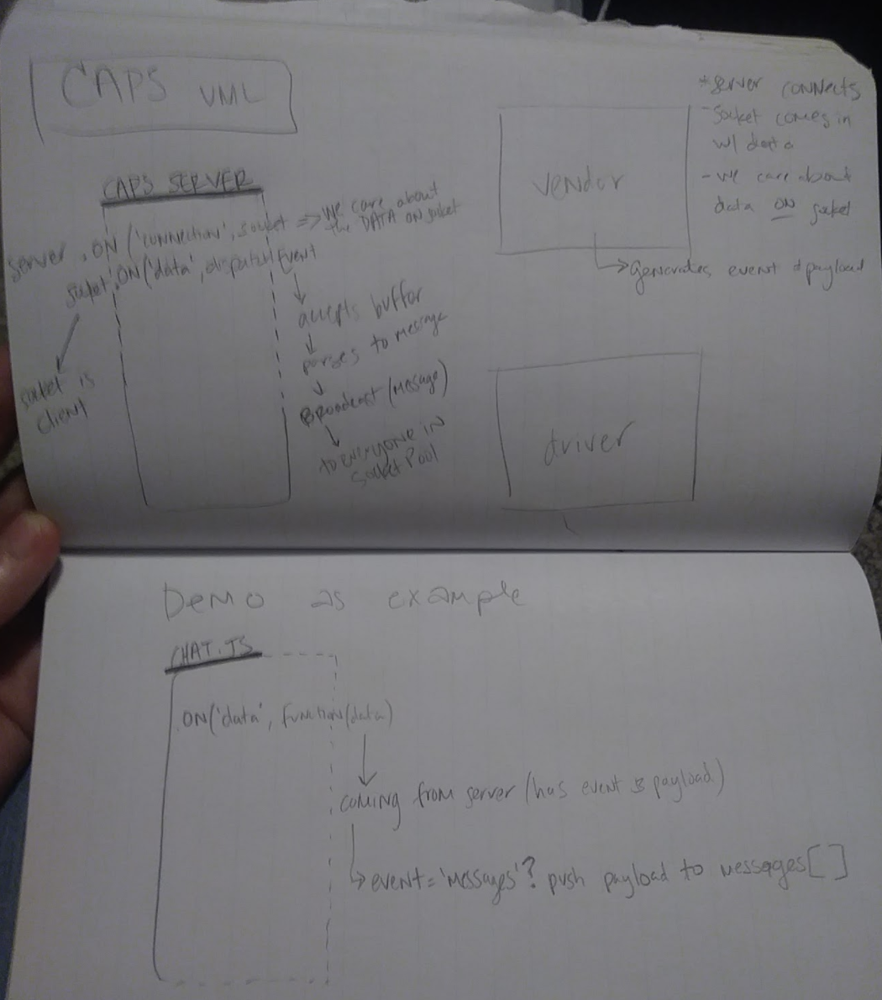
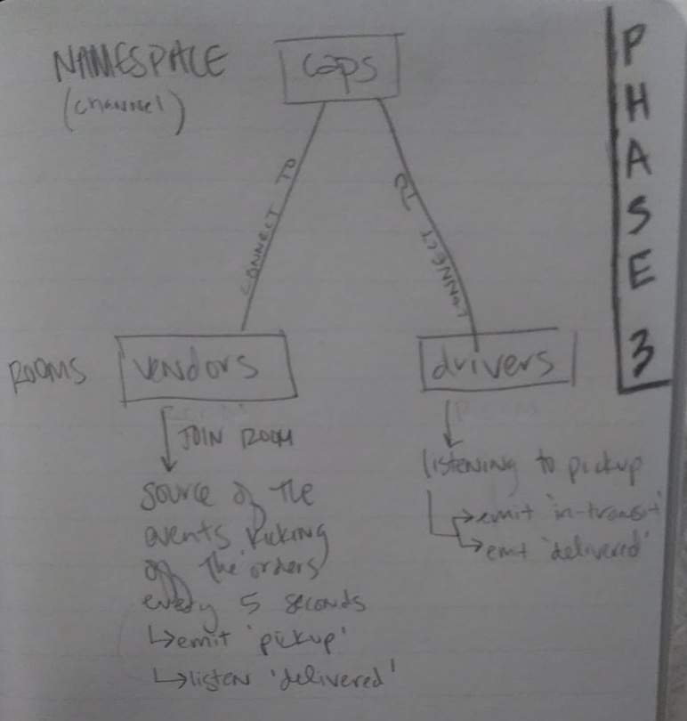

# CAPS
## Code Academy Parcel Service

Code 401 Lab 16-19 Project

**Description**
This project is a 4-day buildout of the CAPS (Code Academy Parcel Service) system. This is a real-time service that allows for **vendors** to alert a system of a package needing to be delivered, for **drivers** to instantly see what's in their pickup queue, and then alert the **vendors** as to the state of the deliveries. 

## Author
Tia Low

### About
Full-stack JavaScript developer with a diverse background of personal and professional experience.

## Collaborations and Resources
- Alex Whan: [GitHub](https://github.com/alex-whan)
- Joshua Beasley : [GitHub](https://github.com/beasleyDOTcom)
- Chris Hamersly: [GitHub](https://github.com/christopherhamersly)
- Lulu Sevignon: [GitHub](https://github.com/luluse)
- Steve Baldock: [GitHub](https://github.com/SBALDOCK)
- Daisy Johnson: [GitHub](https://github.com/daisyjanejohnson)

## Version
1.0.3

## ENV SAMPLES
- PORT=
- STORE_NAME=
- HOST=

## Tech
- dotenv
- net
- socket.io
- socket.io-client

<!-- ## Domain Modeling -->

## Daily Log
Monday : 8-31-20 : **Phase 1**
- Goal is to setup a system of events and handlers with the intent being to change out the eventing system as we go, but keep handlers themselves largely the same  

Tuesday : 9-01-20 : **Phase 2**
- Spreading functionality to multiple applications so users on different computers and connections can communicate in real time as packages are prepared, picked up, and delivered
- Now using multiple apps to raise and listen for the events

Wednesday : 9-02-20 : **Phase 3**
- Changing the underlying networking implementation of the system from using raw TCP to using a socket.io, which will manage the connection pool. This makes broadcasting much easier to operate, and works well both on the terminal between servers and with web clients.
- This phase refactors the networking layer. 
- Network event driven system using Socket.io 

Thursday : 9-03-20 : **Phase 4** : **__**
- 

<!-- ### Swagger Hub Documentation
https://app.swaggerhub.com/apis/TiaLow/online-store/0.1#/info -->

### UML Diagram

